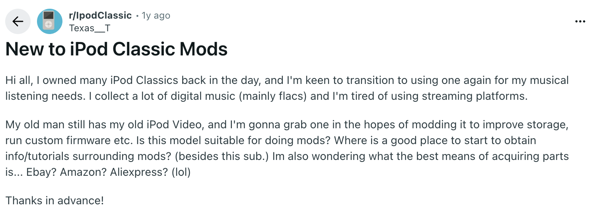
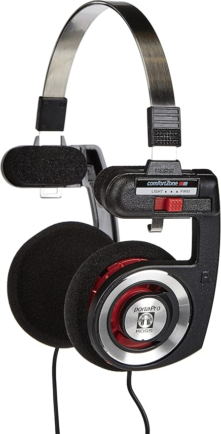

# My Experience Modding an iPod Classic 5.5 80GB

I recently fell down the rabbit hole of **iPod refurbishing**, mostly thanks to YouTube's relentless recommendations. This is a write-up of my research process, how I sourced the hardware, and the choices I made along the way.

---

## Identifying the Right Model

The iPod line ran from 2001 to [2022](https://www.bbc.com/news/technology-61401626), spanning many generations with significant differences between them. The first step was learning how to tell them apart.

Apple's own support page was a solid starting point:
[Identify your iPod model — Apple Support](https://support.apple.com/it-it/103823)

From there, a Reddit thread led me to a GitHub-hosted guide covering everything from battery replacement and RAM specs to custom firmware and backplate compatibility:

[https://yuuiko.github.io/iPodGuide/index.html](https://yuuiko.github.io/iPodGuide/index.html)

---

## Why the iPod Classic 5.5 with 80GB?

After going through the guide, I settled on the **iPod Classic 5.5 (80GB)**. Here's the reasoning:

**Why Classic over Nano, Touch, etc.?**
The 5th and 5.5 generations are the most mod-friendly: they have a larger screen and accept bigger batteries than other models.

**Why not 6th gen or later?**
They're harder to open, have fewer moddable features, and have a worse design (imo).

**Why 5.5 over 5?**
The 5.5 adds a **search function** and a **brighter display**.

**Why 80GB over 30GB?**
The 80GB model comes with **64MB of RAM** vs. **32MB** on the 30GB. This makes a noticeable difference when navigating large music libraries.

---

## Sourcing the iPod

I searched across **Vinted**, **Wallapop**, **Subito**, and **Facebook Marketplace**. After a few days I found a great deal on Vinted — an iPod 5.5 with 80GB that had already received some upgrades:

.webp)

.webp)

- Original 80GB HDD
- New screen
- New black backplate with aftermarket logos (the closest I found new was a [20€+ version from Elite Obsolete](https://eoe.works/collections/ipod-video-5th-5-5-generation-replacement-parts/products/universal-thick-black-chrome-backplate-for-apple-ipod-video-classic-5th-5-5-6th-7th))
- New transparent front plate

---

## Parts: What I Ordered (and What I Changed)

Before the iPod arrived, I put together an AliExpress order:

[**Front plate**](https://it.aliexpress.com/item/1005009344395215.html?spm=a2g0o.order_list.order_list_main.5.1ac03696EUqb94&gatewayAdapt=glo2ita)

[**3000mAh battery**](https://it.aliexpress.com/item/1005008716350605.html?spm=a2g0o.order_list.order_list_main.21.1ac018028dAJyw&gatewayAdapt=glo2ita)

[**CF to ZIF adapter**](https://it.aliexpress.com/item/1005007247214533.html?spm=a2g0o.order_list.order_list_main.11.1ac018028dAJyw&gatewayAdapt=glo2ita) — a much cheaper alternative to [iFlash adapters](https://www.iflash.xyz/)

[**Micro SD to CF card adapter**](https://it.aliexpress.com/item/1005005721062224.html?spm=a2g0o.order_list.order_list_main.15.1ac018028dAJyw&gatewayAdapt=glo2ita)

---

### Update — 20 December 2025

I made a critical mistake: the CF to ZIF adapter combined with the 3000mAh battery is too thick to fit inside the back case. I had to switch plans and ordered the [iFlash-Quad](https://www.iflash.xyz/) instead. I managed to resell the CF and SD adapters on Vinted to recover some of the cost.

.png)

---

### Update — 14 January 2026

After nearly a month of waiting, the iFlash-Quad finally arrived. I paired it with a 64GB microSD card I already had. The iFlash-Quad supports up to four microSD cards, making it the most future-proof storage solution available for this device.

---

## Software: RockBox

Instead of Apple's stock iPod OS, I went with [RockBox](https://www.rockbox.org/) — an open-source firmware replacement that runs on a wide range of digital audio players, not just iPods. It's been in active development since 2001 and supports an enormous number of devices.

Compared to the original firmware, RockBox offers far greater customizability: you can install themes, tweak the UI, adjust equalizer settings in detail, and even play formats that Apple's firmware doesn't support (FLAC, Ogg Vorbis, and more). It can also be installed alongside the original firmware, so you can dual-boot if needed.

Another funny part is that it allows to play simple games like snake or solitaire (even Doom is pre-installed but runs pretty slow, strange beacuse nowadays it can run even on potatoes).

The installation process is straightforward thanks to the [RockBox Utility](https://www.rockbox.org/wiki/RockboxUtility), an official desktop app that handles everything automatically.

I'm currently using the [OneBit_OLED](https://themes.rockbox.org/index.php?themeid=3901) theme.

---

## Headphones

After some research, I picked up a pair of **Koss Porta Pro** over-ear headphones. Highly recommended.

---

## Retrospective

It's entirely possible to build a similar setup for less. The iFlash-Quad is the most expensive component and can be replaced with the CF to ZIF + microSD to CF adapter combo, paired with a smaller battery (the 1200mAh variant should fit safely).

A few other notes:
- I never ended up using the search function on the 5.5, so in hindsight that wasn't a deciding factor for me — though I still recommend the 80GB model for the RAM advantage.
- Bluetooth mods are possible but require soldering. Pre-built Bluetooth back configurations exist but are expensive and, in my view, not worth it.

---

## Total Cost

*(The CF to ZIF adapter and microSD to CF adapter are excluded — I resold them on Vinted.)*

| Item | Cost (€) |
|---|---|
| iPod Classic 5.5 80GB | €106.20 |
| Green front plate | €11.30 |
| 3000mAh battery | €10.89 |
| iFlash-Quad | €61.61 |
| Koss Porta Pro | €39,30|
| **Total** | **€229.30** |
